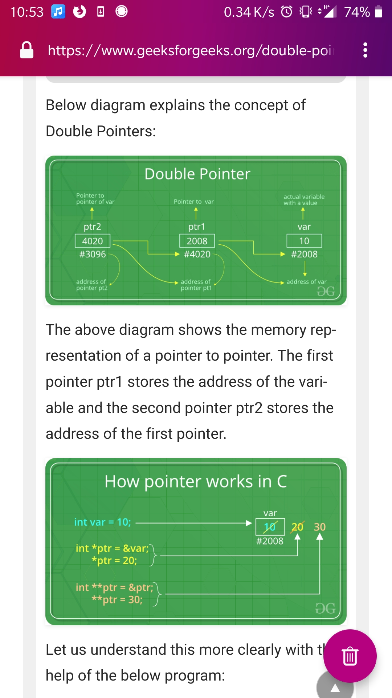

## constexpr

Example, let's say we have a function:

```cpp
constexpr double square(double x)
```

- Basically means, I can or cannot be a constant. It depends on the evaluation at compile time.
- `constexpr` functions should be simple.
- The idea is to reuse a function's definition for both `const` and non `const` variables.
- Before you would have had to define this function twice in order to use it with
`const` variables.

## copy constructor

Gets called whenever we are constructing a new object from an existing one: `Bus local(existing_bus);`
Which is the same as: `Bus local = existing_bus;`
See [Copy constructors](https://en.cppreference.com/w/cpp/language/copy_constructor)
Definition:
```cpp
// class_name ( const class_name & )
struct A
{
    int n;
    A(int n = 1) : n(n) { }
    A(const A& a) : n(a.n) { } // user-defined copy ctor
};
```

## copy assignment operator

Gets called when we are updating an existing object by assigning it an existing one:

```cpp
Bus local, another;
local = another; // copy assignment operator called
```

It has two main forms: `class_name & class_name :: operator= ( class_name )`, this is the typical declaration of a copy assignment operator when **copy-and-swap idiom** can be used. This idiom can be used when there is no need for **deep copy**. Meaning when no heap allocations are needed to be managed. Meaning when there are no pointers. Which you can see below in `Struct A`.
**Note:** That even though `Struct B` added `string s2` inherited copy constructor takes care of the swapping

The second form: `class_name & class_name :: operator= ( const class_name & )`, you can see in `Struct C`

See [Copy constructors](https://en.cppreference.com/w/cpp/language/copy_assignment) and [Assignment Operator](https://en.cppreference.com/w/cpp/language/operators#Assignment_operator)
Definition:
```cpp
struct A
{
    int n;
    std::string s1;
    // user-defined copy assignment, copy-and-swap form
    A& operator=(A other)
    {
        std::cout << "copy assignment of A\n";
        std::swap(n, other.n);
        std::swap(s1, other.s1);
        return *this;
    }
};

struct B : A
{
    std::string s2;
    // implicitly-defined copy assignment, calls copy assignment of A
};

struct C
{
    std::unique_ptr<int[]> data;
    std::size_t size;
    // non-copy-and-swap assignment
    C& operator=(const C& other)
    {
        // check for self-assignment
        if(&other == this)
            return *this;
        // reuse storage when possible
        if(size != other.size)
        {
            data.reset(new int[other.size]);
            size = other.size;
        }
        std::copy(&other.data[0], &other.data[0] + size, &data[0]);
        return *this;
    }
    // note: copy-and-swap would always cause a reallocation
};
```


## copy elision

Compiler optimization that prevents unnecessary copy.
See [Copy elision](https://en.cppreference.com/w/cpp/language/copy_elision)

## aggregate initialization

Preferred way to initialize values: `double d {2.3}`
Because the compiler will through an error when there is lots of information.
Example when converting from double to int. Or from int to char.

See [aggregate initialization](https://en.cppreference.com/w/cpp/language/aggregate_initialization)

## declaring pointer to a pointer

`char *p`, reads as pointer to.
In an expression: `*p = 'R'` or `char P = *p`, is read as contents of pointer.
`&` in an expression: `char *pp = &p` is read as address of

`**` notation means:
we have a pointer to a pointer.

Rarely used in C++ language

In the C language is normally used when you want to `realloc` a pointer, and you need a double pointer because the value of the intermediate pointer is going to change. Meaning, `&var` is going to be different. Example:

```cpp
int *ptr = var;

void func(int **var) { var = (int *) realloc(sizeof(int)); }
```



## functions and raw arrays

Raw arrays cannot be passed by value

A function taking a `char *`, that could be a pointer to an individual char or a pointer to char array

That is why is better to be specific. Example: `void foo(int A[], int size)`

This is a function that takes a int array, you could write it as in *A, but that is ambiguous.

You could also return a raw array:

```cpp
int [] custom_alloc(int size) {
  return (int *) malloc (size*sizeof(int));
}
```

## if statement with initializer

You can initialize a variable in an of statement, place semi colon an evaluate.
Example:
```cpp
if (auto [it, inserted] = map.insert({ "hello", 3 }); !inserted) 
  std::cout << "hello already exists with value " << it->second << "\n";

if (auto [it, inserted] = map.insert({ "foo", 4 }); !inserted)
  std::cout << "foo already exists with value " << it->second << "\n";
```

## method chaining

Useful for the builder pattern when you call a bunch of set_x methods

Just: `return *this;`

```cpp
class Fbo {
  Fbo& setType(GLenum type) {
    _type = type;
    return *this;
  }
};

// then you can do:

Fbo f; f.setType(GL_FLOAT).setFormat(GL_RGB).setIntFormat(GL_RGB32F_ARB).init();
```

## sizeof()

`sizeof( type )`: Yields the size in bytes of the object representation of _type_.
`sizeof expression`: Yields the size in bytes of the object representation of the type of expression, if that expression is evaluated.

Returns the size of a type in bytes. Example: `sizeof(char) = 1 byte`

You can use it to get the number of items in a raw array:
```cpp
int num_items = sizeof(array_name)/sizeof(type_of_array)
```

## std::forward

If you the following functions:
```cpp
template<class T> f(T& t) { printf("f(T&)"); }
template<class T> f(T&& t) { printf("f(T&&)"); } 
```

And you simply call `f(S())`, let's assume `S` is an empty class, what you will get is: `f(T&&)` printed.

That is a good thing

Now if we add a third function, that simply wraps `f`:

```cpp
template<class T> wrapf(T&& t) { f(t); } 
```

And you simply call `wrapf(S())` you will NOT get `f(T&&)` printed.
What you will get is `f(T&)`

In order to properly forward you have to use.... you guessed it, as such:
```cpp
template<class T> wrapf(T&& t) { f(std::forward<T>(t)); }
```

## std::forwarding parameter packs

TODO: Bring content here
[Read here](https://stackoverflow.com/questions/32018519/in-perfect-forwarding-what-is-the-difference-between-decltypestdforwardargs)

## std::function vs template

TODO: Bring content here
[Read here](https://stackoverflow.com/questions/14677997/stdfunction-vs-template#14678298)

## template syntax

Precede the declaration with `template <class T>`

Then everywhere you want to substitute a data type just use T

Now when defining a function, for example in a cpp file do the following:

```cpp
template <class T>
T Arithmetic<T>::add(const T& a, const T&b) { return a + b; }

// Then declare an object:
Arithmetic<int> ar;
```

## string literal

- A string literal is sequence of characters surrounded by double quotes:
  - `"Hello World!\n"`
- Note that the null terminator is added automatically

## Auto

- With `auto` you have to use `=`, no `{}` initializer.
- Example uses of `auto`:

```cpp
//good : auto increases readability here
for(auto it = std::begin(v); it != std::end(v); ++it)//v could be array as well
{
  //..
}

//bad : auto decreases readability here
auto obj = ProcessData(someVariables);

//without auto. Not that good, looks cumbersome
SomeType<OtherType>::SomeOtherType * obj1 = new SomeType<OtherType>::SomeOtherType();
std::shared_ptr<XyzType> obj2 = std::make_shared<XyzType>(args...);
std::unique_ptr<XyzType> obj2 = std::make_unique<XyzType>(args...);

//With auto. good : auto increases readability here
auto obj1 = new SomeType<OtherType>::SomeOtherType();
auto obj2 = std::make_shared<XyzType>(args...);
auto obj3 = std::make_unique<XyzType>(args...);
```

## enums

```cpp
// They are ints unless you say otherwise.
enum class Color {red, green, yellow};
enum class Traffic_Light {yellow, green, red};

Color c = Color::red;
Traffic_Light t = Traffic_Light::red;
```

- You can also define operators and functions for an `enum class`:

```cpp
Traffic_Light& operator++(Traffic_Light& t) {
  switch(t) {
    case Traffic_Light::green: return t = Traffic_Light::yellow;
    case Traffic_Light::red: return t = Traffic_Light::green;
    case Traffic_Light::yellow: return t = Traffic_Light::red;
  }
}

// Now you can:
Traffic_Light next = ++light; // Assuming light = yellow it will go red
```

## a function declaration

Is just it's name, like in an `hpp` file.

## a function definition

Is what is does, like in the `cpp` file.


## namespaces

- Its use for expressing that some declarations belong together and their namespaces shouldn't clash with that of others.
- For example this allows you to have your own `string` implementation, as opposed to that of `std::string`.
- They are mainly used in libraries.

## RAII

- The technique is called Resource Acquisition Is Initialization **(RAII)**.
- It allows to eliminate _naked new operators_ that you then must remember to `delete`.
- Basically if you need to use `new` it should be wrapped in a class
- That way you allocate in constructor and deallocate automatically in the destructor.

## `using`

- Preferred over `typedef`
  - Mainly because the alias declaration is compatible with templates, whereas the C style `typedef` is not.
- Examples:

```cpp
using size_t = unsigned int;
template<typename Value>
using String_map = Map<string, Value>
String_map<int> m; // m is a Map<string,int>
```

## all literals

```cpp
255, 0377, 0xff // Integers (decimal, octal, hex)
2147483647L, 0x7fffffffl // Long (32-bit) integers
123.0, 1.23e2 // double (real) numbers
'a', '\141', '\x61' // Character (literal, octal, hex)
'\n', '\\', '\'', '\"' // Newline, backslash, single quote, double quote
"string\n" // Array of characters ending with newline and \0
"hello" "world" // Concatenated strings
true, false // bool constants 1 and 0
```

## extern

```cpp
extern int x = 10; // Declaration of extern
extern int x; // Information only, declared elsewhere
```

## argv and argc


