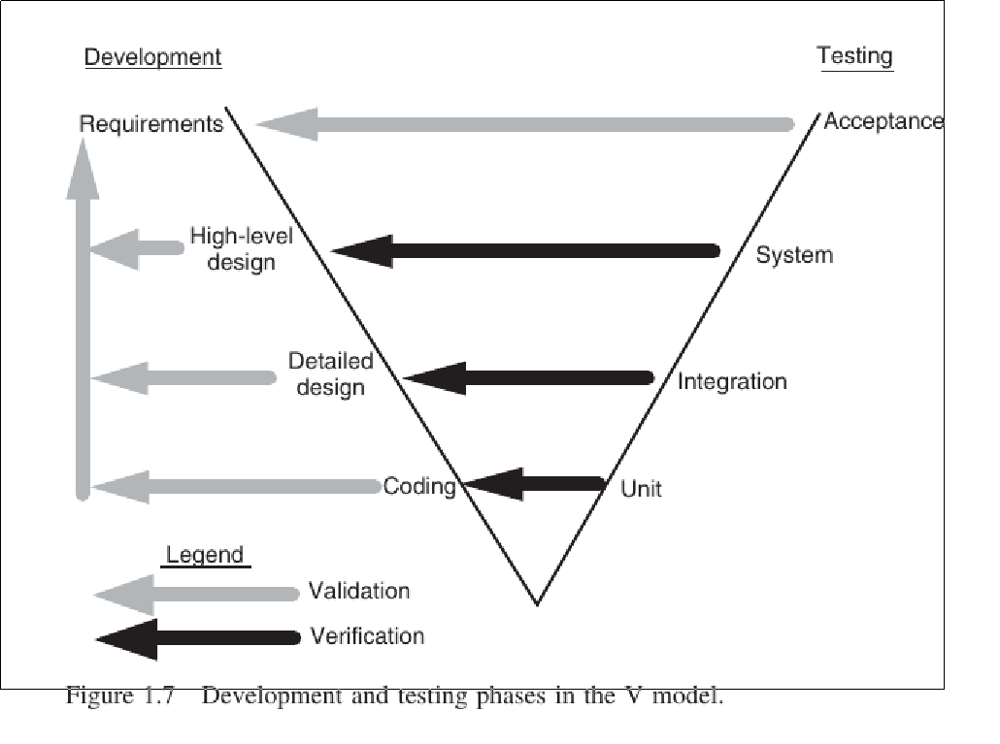

# Book: /home/reinaldo/External/reinaldo/resilio/masters/spring_2019/insc_581/software_testing_and_quality_assurance_theory_and_practice_by_naik___tripathy.pdf


## Test Levels::1.13



## Unit testing

Individual program units
Such as functions, classes, in isolation.

## Integration testing

The objective is to construct a stable system that can withstand system-level testing

## System level testing

Includes a wide spectrum of testing
functionality testing
stress testing
load testing
security testing
reliability testing

## Regression testing

Idea is to ensure that modifications have not introduced new faults

## Acceptance testing

Normally performed by the customer
The system is handed to the customer after system level testing for acceptance testing

## Black Box Testing

More like system level testing

## White Box Testing

Unit tests

## Sample math

[$]\frac{d}{dx}(e^x)[/$]

## Sample code

this is a really cool struct

```cpp
struct typo {
  int rok;
  string capa;
}
``````

this is another really cool struct
